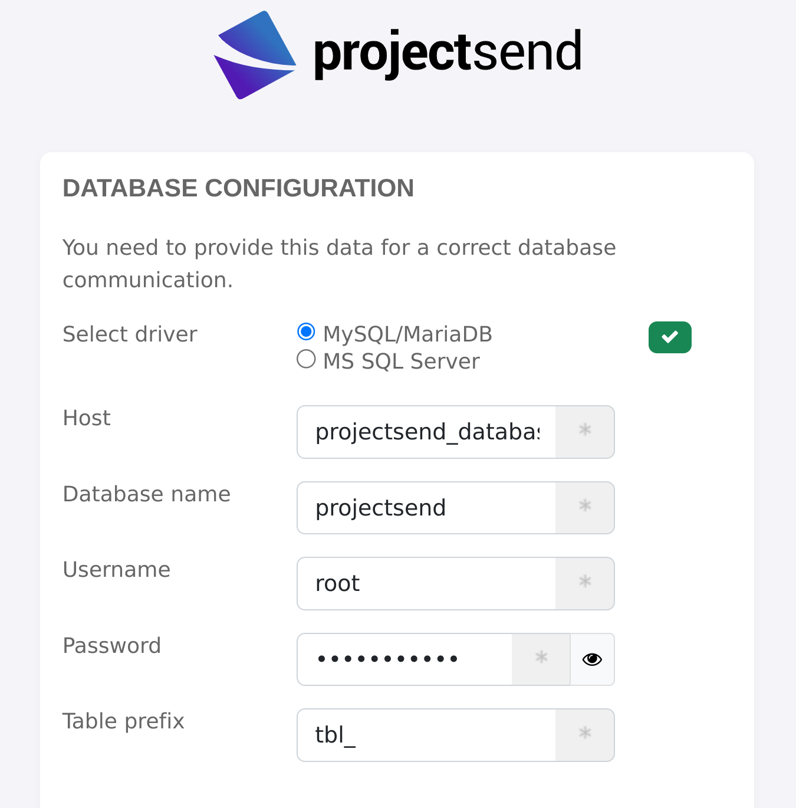

# Docker container deployment for [ProjectSend](https://docs.linuxserver.io/images/docker-projectsend)

This repository automates [ProjectSend](https://docs.linuxserver.io/images/docker-projectsend) deployment together with the required MariaDB instance, because the provided ProjectSend guide does not explain database deployment. We simply compose MariaDB and ProjectSend services together, and share the required accessdata.

## Prerequisites

Create `.env` file with database root password:

```
$ cat .env
MARIADB_ROOT_PASSWORD=setyourpasswordhere!
```

## Deployment

1. Deploy the container:

```
docker-compose up -d
```

2. Go to http://localhost:58080 and configure ProjectSend as shown below:


 
